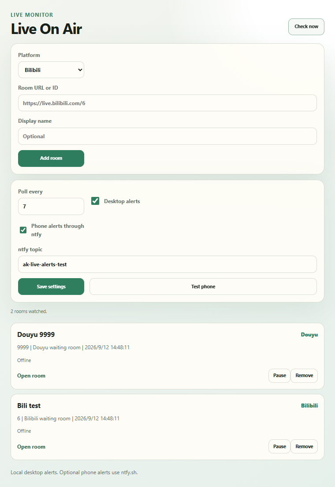

# Live On Air

[](https://github.com/AK1116q/live-on-air/actions/workflows/ci.yml)

**Desktop and phone alerts for Bilibili and Douyu live rooms.**

Live On Air is a local-first browser extension that watches selected Bilibili and Douyu rooms. When a room changes from offline to live, it can show a desktop notification and optionally send a phone notification through [ntfy.sh](https://ntfy.sh).



## What It Does

- Watches Bilibili and Douyu numeric room IDs.
- Accepts room IDs or normal room URLs.
- Polls in the browser background with Chrome extension alarms.
- Sends desktop notifications through the browser.
- Sends optional phone notifications through an ntfy topic.
- Avoids immediate noise by saving the current live state when a room is first added.
- Stores everything in the current browser profile through `chrome.storage.local`.

## Install

1. Download or clone this repository.
2. Open `chrome://extensions` in Chrome or `edge://extensions` in Edge.
3. Enable **Developer mode**.
4. Choose **Load unpacked**.
5. Select the folder that contains `manifest.json`.
6. Pin the extension and open the popup.

Node.js is not required to install or use the extension.

## Add a Room

Paste a room URL or numeric room ID, choose the platform, then click **Add room**.

Examples:

```text
https://live.bilibili.com/6
https://www.douyu.com/9999
6
9999
```

Only numeric room IDs are supported. Vanity Douyu paths are not resolved yet.

## Desktop Alerts

Desktop alerts use the browser's extension notification permission. Keep Chrome or Edge running so the background alarm can poll rooms.

The extension alerts only when a room changes from offline to live. A room that is already live when added is recorded as live and will not send an immediate alert.

## Phone Alerts

Phone alerts use ntfy:

1. Install the ntfy app on your phone.
2. Subscribe to a private topic name, for example `ak-live-alerts-2026`.
3. Enter the same topic in the extension settings.
4. Enable **Phone alerts through ntfy**.
5. Click **Test phone**.

Anyone who knows the topic name can subscribe to it, so use a long private topic. This extension sends only the room title and room URL.

## Platform Sources

Bilibili is checked through:

```text
https://api.live.bilibili.com/room/v1/Room/get_info?room_id={roomId}
```

Douyu is checked through:

```text
https://www.douyu.com/betard/{roomId}
```

These are observed web endpoints, not guaranteed official contracts. Platform changes may require provider updates.

## Limits

- Polling too frequently can annoy platforms and may get requests throttled. The default interval is 5 minutes.
- The browser must be running for alerts to work.
- Mobile alerts require ntfy and internet access.
- The extension does not log in, read cookies, or call paid/private APIs.
- It does not support Bilibili user IDs, Douyu vanity names, livestream chat, recording, or stream downloads.

## Development

Requires Node.js 22 or newer. No install step is needed.

```bash
npm test
```

Project structure:

- `core.js` parses rooms, validates settings, checks platform status, and formats notifications.
- `background.js` stores subscriptions, schedules polling, and sends notifications.
- `popup.*` renders the extension UI.

See [validation notes](docs/VALIDATION.md) and [contributing notes](CONTRIBUTING.md).

## Roadmap

- Resolve Douyu vanity room paths.
- Add import and export for the watch list.
- Add quiet hours for late-night alerts.
- Add per-room alert channels.

## License

[MIT](LICENSE)
